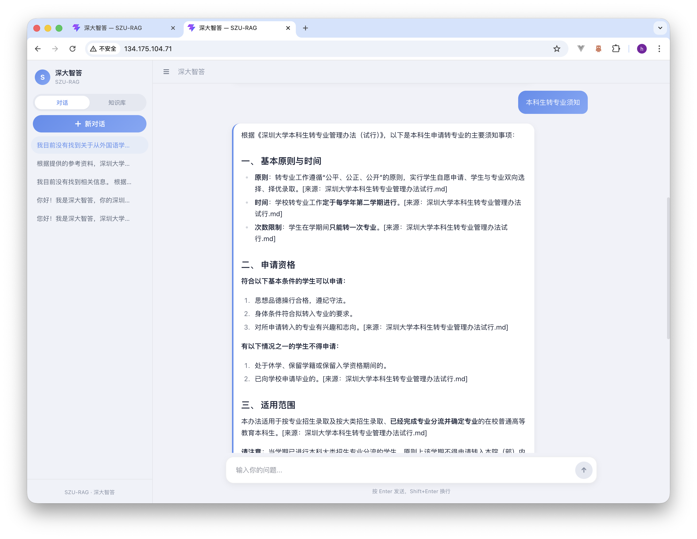
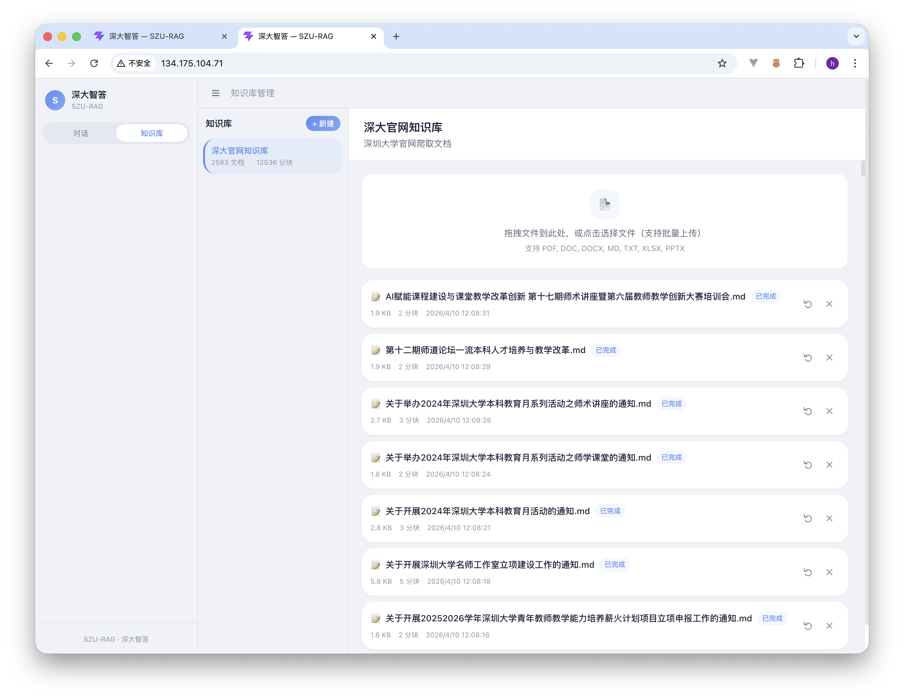
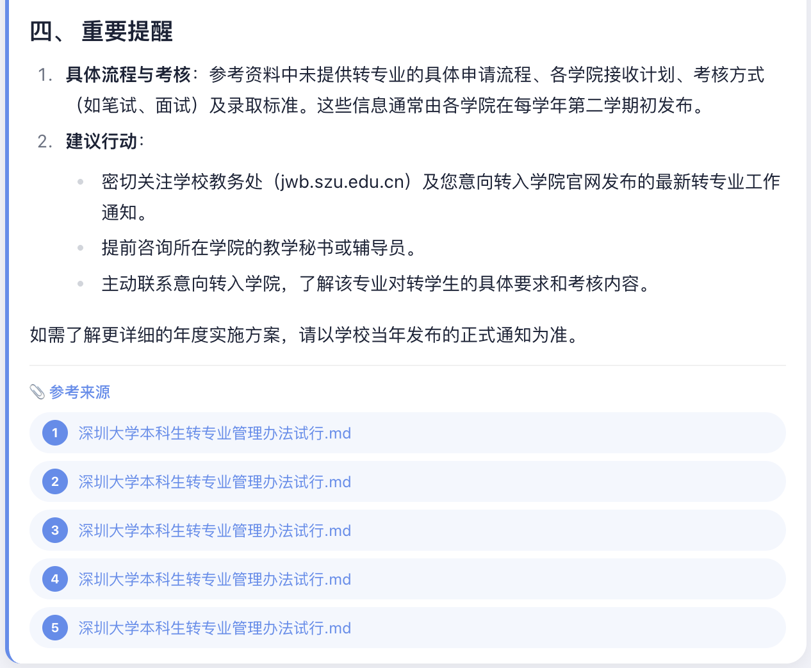

<div align="center">

# 深大智答 SZU-RAG

**深圳大学校园智能问答助手 — 基于 RAG 架构的全栈 AI 应用**

[](https://www.oracle.com/java/)
[](https://spring.io/projects/spring-boot)
[](https://react.dev/)
[](https://milvus.io/)
[](https://www.docker.com/)

</div>

---

## 项目简介

**深大智答** 是一个面向深圳大学师生群体的校园智能问答系统，基于 **RAG（检索增强生成）** 架构构建。系统支持批量文档上传管理，经过智能文档处理和向量化索引，结合 Multi-Query 查询分解、DashScope Reranker 重排序与大语言模型实现精准的校园信息问答，回答附带来源引用，确保信息可溯源。系统针对学生、教职工、访客三种角色提供差异化回答（办事流程/政策依据/招生咨询）。

> 从文档管理到智能问答的完整闭环，为师生提供 **精准、实时、可溯源** 的校园信息服务。

---

## 项目预览

<table>
  <tr>
    <td align="center"><b>智能对话问答</b></td>
    <td align="center"><b>知识库管理</b></td>
  </tr>
  <tr>
    <td></td>
    <td></td>
  </tr>
  <tr>
    <td align="center">结构化回答 · 来源溯源 · 多轮对话</td>
    <td align="center">多格式上传 · 状态追踪 · 批量管理</td>
  </tr>
</table>

<div align="center">
  
  <p><b>智能回答详情</b> — 结构化建议 · 重要提醒 · 参考来源</p>
</div>

---

## 项目亮点

### 全栈 RAG 系统闭环
从文档上传 → 文档解析（Tika）→ 智能分块（多策略）→ 向量索引（Milvus）→ Multi-Query 查询分解 + DashScope Reranker 重排序 → 检索增强生成（DeepSeek V3）→ 流式问答（SSE）的完整链路，覆盖 RAG 系统全生命周期。

### 校园场景深度特化
面向深圳大学场景的专项优化，让系统从"通用问答"进化为"真正懂深大"的校园助手：
- **学术日历感知**：自动识别当前教学周/学期/近期事件，注入 Prompt 实现时间相关回答
- **校园实体词典**：40+ 口语→标准术语映射（"荔园"→"深圳大学"、"四六级"→"CET"），提升检索召回
- **LLM 查询重写**：DeepSeek 改写口语查询 + 时间表达式解析，检索效果显著提升
- **Multi-Query 查询扩展**：将用户查询分解为多个子查询，扩大检索覆盖面，提升召回率
- **Reranker 精排**：DashScope Reranker 对检索结果进行语义精排，显著提升最终答案的相关性
- **校园通知特化分块**：短通知整篇保留、长文档按段落分块，携带部门/分类等元数据
- **混合检索（语义 + 关键词）**：Milvus 语义检索 + MySQL 全文检索 → RRF 融合排序
- **角色感知回答**：学生（办事流程）/ 教职工（政策依据）/ 访客（招生咨询）三种角色差异化回答

### 批量文档上传管理
支持手动批量上传多格式文档（PDF、Word、Excel、PPT、Markdown、纯文本），通过知识库面板统一管理文档生命周期，实时查看处理状态和进度。

### 智能文档处理管线
- **多格式解析**：Apache Tika 支持 PDF、Word、Excel、PPT、Markdown、纯文本
- **多策略分块**：固定大小、结构感知（按标题/段落）、递归分块、**校园通知专用分块**，可按知识库灵活配置
- **元数据增强**：注入部门、分类、文档类型等元数据，支持 Milvus 过滤检索
- **内容溯源**：每个分块保留来源标题、发布日期、部门、分类，回答时可精确引用

### 向量检索 + 大模型生成

- **Milvus 向量数据库**：高性能相似度搜索，支持跨知识库联合检索、元数据过滤、按相关度排序
- **混合检索**：语义检索（Milvus）+ 关键词检索（MySQL FULLTEXT + ngram）→ RRF 融合，兼顾语义理解和精确匹配
- **阿里百炼 DashScope Embedding**：text-embedding-v3（1024 维），中文语义理解能力强
- **DeepSeek V3**：通过 OpenAI 兼容 API 接入，支持流式生成
- **Prompt 模板引擎**：StringTemplate 4 管理提示词，自动注入日历上下文和角色指令

### SSE 流式问答体验

基于 Server-Sent Events 实现实时流式响应，支持 `thinking`（思考状态）、`sources`（来源引用含部门/分类/相关度）、`content`（内容流式输出）、`complete`（完成统计）四种事件类型，前端实时渲染 Markdown 并展示富来源卡片。

### 一键 Docker 全栈部署

Docker Compose 编排 8 个服务（MySQL、Redis、Milvus + etcd + MinIO、后端、前端），一条命令启动完整系统，开箱即用。

### MCP 集成规划（进行中）

计划接入学校各业务系统接口作为 MCP Tool，实现从"信息问答"到"业务办理"的跨越，打造真正的校园 AI 智能助手。详见 [MCP 集成计划](#-mcp-集成计划--项目前景)。

---

## 系统架构

```
                              深大智答 SZU-RAG
                                    │
       ┌──────────┬──────────┬──────┴──────┐
       ▼          ▼          ▼             ▼
  数据处理层  查询理解层   检索生成层     展示层
 ──────────  ──────────  ──────────  ──────────
 Apache Tika Query       Milvus      React+Vite
 Parser  →   Rewriter → Vector DB → ChatWindow
 Multi-Strat EntityExp   │           MessageBubble
 Chunker     TimeResolver DeepSeekV3  CalendarWidget
    │           │         │          RoleSelector
 Embedding  Calendar    Multi-Query  SSE Stream
 (DashScope) Service    Reranker    Markdown Render
    │           │       Prompt Eng. Source Citation
  Milvus    Campus     Conv Memory  Role-Aware
  Index     Calendar   Hybrid
                        Retrieval
                        (RRF Fusion)
    │           │         │            │
    └───────────┴────┬────┴────────────┘
                    ▼
              ┌────────────────────────────────────┐
              │   MySQL 8.0 · Redis 7 · Nginx      │
              └────────────────────────────────────┘
```

---

## 技术栈

| 层级 | 技术 | 版本 | 说明 |
|------|------|------|------|
| **后端** | Java + Spring Boot | 17 / 3.5.7 | 主框架 |
| | MyBatis Plus | 3.5.9 | ORM |
| | Apache Tika | 2.9.2 | 文档解析 |
| | Sa-Token | 1.42.0 | 认证鉴权 |
| | StringTemplate 4 | 4.3.4 | Prompt 模板 |
| **向量数据库** | Milvus | v2.4.17 | 向量存储与检索 |
| **关系数据库** | MySQL | 8.0 | 业务数据持久化 |
| **缓存** | Redis | 7 | 会话缓存、限流 |
| **LLM** | DeepSeek V3 | — | 大语言模型（OpenAI 兼容 API） |
| **Embedding** | 阿里百炼 DashScope | text-embedding-v3 | 1024 维中文向量 |
| **前端** | React + TypeScript | 19 / Vite 6 | SPA 界面 |
| | TailwindCSS | 4.x | 样式 |
| | Zustand | 5.x | 状态管理 |
| | react-markdown | — | Markdown 渲染 |
| **部署** | Docker Compose | — | 8 服务全栈编排 |
| | Nginx | — | 前端托管 + SSE 代理 |

---

## 项目结构

```
SZU-RAG/
├── docker-compose.yml              # 全栈部署编排（8 个服务）
├── .env.example                    # 环境变量模板
├── docs/                           # 项目截图与文档
│   ├── chat-demo.png
│   ├── knowledge-base.png
│   └── answer-detail.png
│
├── szu-rag-backend/                # Java 后端
│   ├── Dockerfile
│   ├── pom.xml
│   ├── docker-compose.dev.yml      # 开发环境基础设施
│   └── src/main/java/com/szu/rag/
│       ├── framework/              # 框架层（异常体系、统一响应、SSE、雪花ID）
│       ├── infra/                  # 基础设施层（LLM客户端、Embedding、Token计数）
│       ├── ingestion/              # 文档处理管线（解析器、分块器、处理引擎）
│       │   └── chunker/            #   固定大小/结构感知/递归/校园通知专用分块
│       ├── knowledge/              # 知识库管理（CRUD、文档上传）
│       ├── rag/                    # RAG 核心
│       │   ├── calendar/           #   学术日历感知（学期/教学周/事件）
│       │   ├── query/              #   查询理解（实体扩展/时间解析/LLM重写）
│       │   ├── retrieval/          #   混合检索（语义+关键词→RRF融合）
│       │   ├── vector/             #   向量检索（Milvus + 元数据过滤）
│       │   ├── prompt/             #   Prompt模板（日历注入 + 角色指令）
│       │   ├── memory/             #   会话记忆（JDBC滑动窗口）
│       │   └── chat/               #   RAG对话编排
│       └── chat/                   # 对话管理（会话、消息）
│
└── szu-rag-frontend/               # React 前端
    ├── Dockerfile
    ├── nginx.conf                  # Nginx 配置（SPA + SSE 代理）
    └── src/
        ├── api/                    # API 客户端（对话、知识库、日历）
        ├── store/                  # Zustand 状态管理（含角色状态）
        └── components/             # UI 组件
            ├── ChatWindow.tsx      #   对话窗口
            ├── MessageBubble.tsx   #   消息气泡（富来源卡片 + 元数据徽章）
            ├── CampusCalendarWidget.tsx  # 校园日历周次组件
            ├── RoleSelector.tsx    # 角色选择器（学生/教职工/访客）
            └── KnowledgePanel.tsx  # 知识库管理面板
```

---

## 核心功能

### RAG 检索增强生成引擎
系统的核心是完整的 RAG 管线：用户提问 → 查询重写（LLM）→ Multi-Query 查询分解（生成多个子查询扩大召回）→ 实体扩展（校园词典）→ Embedding 向量化 → 混合检索（语义 + 关键词 → RRF 融合）→ DashScope Reranker 语义精排 → Prompt 组装（检索结果 + 会话记忆 + 日历上下文 + 角色指令）→ DeepSeek V3 流式生成 → SSE 推送。支持多知识库联合检索、会话记忆（滑动窗口）、来源溯源。

### 校园场景特化

- **学术日历感知**：`CampusCalendarService` 自动计算当前教学周、学期、近期事件，注入 Prompt 使系统具备时间感知能力（如"这学期第几周"、"什么时候期末考试"）
- **校园实体词典**：`CampusEntityExpander` 内置 40+ 校园口语→标准术语映射（荔园→深圳大学、四六级→CET、综测→综合素质测评等），仅用于检索不影响原始提问
- **LLM 查询重写**：`QueryRewriter` 调用 DeepSeek 将口语查询改写为适合检索的结构化查询，`TimeExpressionResolver` 预处理时间表达式（"这学期"→"2025-2026学年第二学期"）
- **角色感知**：学生（办事流程）/ 教职工（政策依据）/ 访客（招生咨询）三种角色注入不同 Prompt 指令，回答侧重点和风格各异

### 混合检索

`HybridRetrievalService` 并行执行语义检索（Milvus cosine）和关键词检索（MySQL FULLTEXT + ngram），通过 RRF（Reciprocal Rank Fusion）融合两路结果，兼顾语义理解和精确关键词匹配。支持 Milvus 元数据过滤（按部门、分类、站点筛选）。

### 智能文档处理管线

文档上传后进入异步处理管线：格式识别 → Tika 解析 → 策略分块 → Embedding 向量化 → Milvus 索引。支持四种分块策略（固定大小、结构感知、递归、**校园通知专用**），可按知识库灵活配置。每个分块携带来源部门、文档类型、分类等元数据，同步写入 MySQL 和 Milvus。

### 对话系统

支持多轮对话、会话记忆、SSE 流式响应。回答自动附带参考来源（文档标题、URL、相关度评分、**来源部门、分类、发布日期**），前端实时渲染 Markdown 格式并展示富来源卡片。支持角色选择（学生-办事流程/教职工-政策依据/访客-招生咨询）。内置速率限制保护。

### 知识库管理

支持创建多个独立知识库（每个对应一个 Milvus Collection），可配置 Embedding 维度、分块策略和参数。支持手动上传和批量上传文档，实时显示文档处理状态和处理进度。

---

## 快速开始

### 前置条件

- [Docker Desktop](https://www.docker.com/products/docker-desktop) 已安装并运行
- Java 17+（仅本地开发需要）
- Node.js 20+（仅本地开发需要）

### 方式一：Docker Compose 一键部署（推荐）

```bash
# 1. 克隆项目
git clone https://github.com/your-username/SZU-RAG.git
cd SZU-RAG

# 2. 配置环境变量
cp .env.example .env
# 编辑 .env，填入 API Key：
#   DEEPSEEK_API_KEY=sk-xxx        # DeepSeek V3
#   BAILIAN_API_KEY=sk-xxx         # 阿里百炼 Embedding

# 3. 构建后端 JAR
cd szu-rag-backend && mvn clean package -DskipTests && cd ..

# 4. 启动全部服务
docker compose up -d

# 5. 查看服务状态
docker compose ps

# 访问地址
# 前端界面:   http://localhost
# 后端 API:   http://localhost:8088
```

### 方式二：本地开发

```bash
# 1. 启动基础设施（MySQL + Redis + Milvus）
cd szu-rag-backend && docker compose -f docker-compose.dev.yml up -d

# 2. 启动后端
export DEEPSEEK_API_KEY=sk-xxx
export BAILIAN_API_KEY=sk-xxx
mvn clean package -DskipTests
java -jar target/szu-rag-backend-1.0.0-SNAPSHOT.jar

# 3. 启动前端（新终端）
cd szu-rag-frontend && npm install && npm run dev
```

### 首次使用

1. 访问 `http://localhost` 进入前端界面
2. 在**知识库**面板创建知识库（如"深大教务处"）
3. 上传文档（支持批量上传）
4. 创建对话，开始提问

---

## API 端点

### 后端服务（:8088）

| 方法 | 路径 | 说明 |
|------|------|------|
| GET | `/health` | 健康检查 |
| **知识库管理** | | |
| POST | `/api/v1/knowledge/bases` | 创建知识库 |
| GET | `/api/v1/knowledge/bases` | 知识库列表 |
| POST | `/api/v1/knowledge/documents/upload` | 上传文档（支持 `sourceSite` 参数） |
| POST | `/api/v1/knowledge/documents/upload/batch` | 批量上传文档 |
| GET | `/api/v1/knowledge/bases/{id}/documents` | 文档列表 |
| DELETE | `/api/v1/knowledge/documents/{id}` | 删除文档 |
| POST | `/api/v1/knowledge/documents/{id}/reprocess` | 重新处理文档 |
| **对话系统** | | |
| POST | `/api/v1/chat/conversations` | 创建对话 |
| GET | `/api/v1/chat/conversations` | 对话列表 |
| POST | `/api/v1/chat/conversations/{id}/messages` | SSE 流式问答（支持 `role` 参数） |
| GET | `/api/v1/chat/conversations/{id}/messages` | 历史消息 |
| DELETE | `/api/v1/chat/conversations/{id}` | 删除对话 |
| **校园日历** | | |
| GET | `/api/v1/calendar/context` | 获取当前教学周/学期/近期事件 |

---

## MCP 集成计划 & 项目前景

### 什么是 MCP？

[MCP（Model Context Protocol）](https://modelcontextprotocol.io/) 是 Anthropic 提出的开放协议，让 AI 模型能够通过标准化的工具接口与外部系统交互。通过 MCP，AI 不仅能够**回答问题**，还能**执行操作**。

### 四大应用场景

#### 学生教务

| MCP Tool | 功能描述 |
|----------|---------|
| `query_schedule` | 查询个人课程表、考试安排 |
| `query_grades` | 成绩查询、GPA 计算 |
| `course_selection` | 选课提醒、余课监控 |
| `academic_calendar` | 校历查询、重要日期提醒 |
| `credit_progress` | 学分完成进度、毕业审核预览 |

#### 图书馆服务

| MCP Tool | 功能描述 |
|----------|---------|
| `search_books` | 馆藏检索、可借状态查询 |
| `my_borrowings` | 借阅列表、到期提醒、在线续借 |
| `seat_available` | 图书馆空座位实时查询 |
| `reserve_room` | 研讨室预约 |

#### 行政办公

| MCP Tool | 功能描述 |
|----------|---------|
| `query_document` | 公文检索与追踪 |
| `reserve_room` | 会议室预约查询 |
| `submit_repair` | 设施报修提交与进度查询 |
| `expense_query` | 财务报销进度查询 |
| `approval_status` | 审批流程状态追踪 |

#### 校园生活

| MCP Tool | 功能描述 |
|----------|---------|
| `campus_card_balance` | 校园卡余额、消费记录 |
| `canteen_menu` | 食堂菜单查询 |
| `shuttle_schedule` | 校巴时刻表、实时位置 |
| `dormitory_info` | 宿舍信息查询 |
| `campus_map` | 校园地图导航 |

### 项目愿景

> **打造深圳大学师生专属的 AI 智能助手生态**

深大智答始于 RAG 知识问答，但不限于此。通过 MCP 协议接入学校各业务系统，我们将构建一个真正理解校园场景的 AI Agent——它不仅能告诉你"怎么选课"，还能帮你查课表、抢余课、提醒截止日期；不仅能回答"报销流程是什么"，还能帮你追踪报销进度。

**技术愿景**：成为高校校园 AI 助手的开源参考实现，探索 RAG + MCP + Agent 的最佳实践。

---

## Roadmap

### MVP（已完成）

- [x] Spring Boot 后端框架 + 分层架构
- [x] RAG 检索增强生成全链路
- [x] React 前端对话界面
- [x] Docker Compose 全栈部署
- [x] SSE 流式问答 + 来源引用

### 校园场景特化优化（已完成）

- [x] **P0 学术日历感知**：校园日历表 + 自动教学周计算 + Prompt 注入
- [x] **P0 校园实体词典**：40+ 口语→术语映射，提升检索召回率
- [x] **P1 LLM 查询重写**：DeepSeek 改写 + 时间表达式解析
- [x] **P1 校园通知特化分块**：短通知整篇保留 + 元数据增强（部门/分类/站点）
- [x] **P2 混合检索**：语义（Milvus）+ 关键词（MySQL FULLTEXT）→ RRF 融合
- [x] **P2 角色感知**：学生/教职工/访客不同回答风格 + 前端角色选择器

### Phase 2：MCP 集成（规划中）
- [ ] MCP Server 模块设计与实现
- [ ] 接入学校教务系统 API（课表/成绩/选课）
- [ ] 接入图书馆系统 API（馆藏/借阅/座位）
- [ ] 接入校园卡系统 API（余额/消费）
- [ ] AI Agent 意图识别 + Tool 调用链路
- [ ] 用户认证系统（对接学校 CAS SSO）

### Phase 3：智能助手生态

- [ ] 多轮任务编排（如"帮我选一门通识课"→ 查课表 → 查余课 → 提醒选课）
- [ ] 主动消息推送（截止日期提醒、成绩发布通知）
- [ ] 多端适配（微信小程序 / 钉钉 / 飞书）
- [ ] 管理后台（知识库运营、用户管理、数据分析）
- [ ] 开源社区建设

---

## License

MIT License
