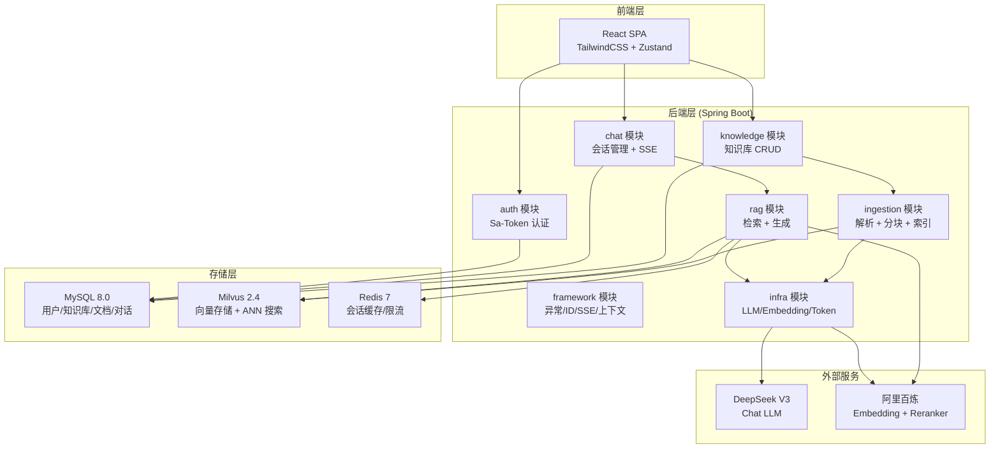
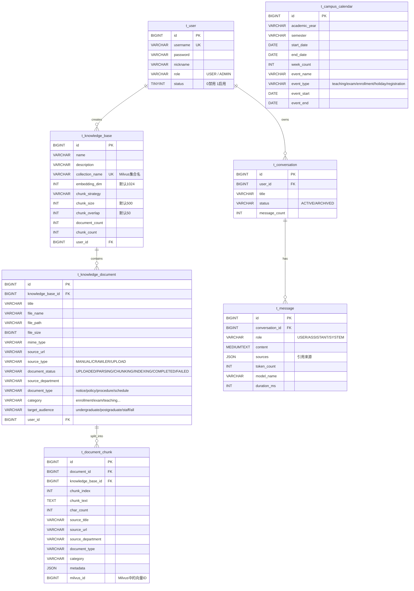

# SZU-RAG 项目技术详解

> 深大智答 — 深圳大学校园智能问答系统，基于 RAG（检索增强生成）架构。

---

## 目录

1. [项目总览](#1-项目总览)
2. [framework 模块 — 基础框架](#2-framework-模块--基础框架)
3. [infra 模块 — 基础设施](#3-infra-模块--基础设施)
4. [ingestion 模块 — 文档摄入](#4-ingestion-模块--文档摄入)
5. [knowledge 模块 — 知识库管理](#5-knowledge-模块--知识库管理)
6. [rag 模块 — 检索增强生成](#6-rag-模块--检索增强生成)
7. [auth + chat 模块 — 认证与会话](#7-auth--chat-模块--认证与会话)
8. [frontend 前端](#8-frontend-前端)
9. [数据库设计](#9-数据库设计)
10. [部署指南](#10-部署指南)

---

## 1. 项目总览

### 1.1 项目简介与核心功能

SZU-RAG（深大智答）是面向深圳大学的校园智能问答系统，核心功能：

| 功能 | 说明 |
|------|------|
| 文档摄入 | 支持 PDF / Word / Excel / PPT / Markdown / 纯文本上传，自动解析、分块、向量化入库 |
| 智能问答 | 基于语义检索 + 关键词检索混合召回，LLM 流式生成回答，附来源引用 |
| 角色感知 | 根据学生/教师/访客角色，调整回答侧重点（流程/政策/招生） |
| 校园日历 | 结合校历感知当前教学周、学期、近期事件，增强时间类问题理解 |
| 实体扩展 | 40+ 校园口语→标准术语映射（"荔园"→"深圳大学"等） |
| 管理后台 | 知识库 CRUD、文档管理、用户管理（ADMIN 角色） |

### 1.2 技术栈清单

| 层次 | 技术 | 版本 / 说明 |
|------|------|-------------|
| 后端框架 | Java 17 + Spring Boot | 3.5.7 |
| ORM | MyBatis-Plus | 3.5.9 |
| 认证 | Sa-Token | 1.42.0（轻量权限框架） |
| 文档解析 | Apache Tika | 2.9.2（PDF/Office 全格式） |
| Prompt 模板 | StringTemplate 4 | 4.3.4 |
| 向量数据库 | Milvus | v2.4.17 Standalone |
| 关系数据库 | MySQL | 8.0 |
| 缓存 | Redis | 7-alpine |
| LLM | DeepSeek V3 | OpenAI 兼容 API，流式输出 |
| Embedding | 阿里百炼 DashScope | text-embedding-v3，1024 维 |
| Reranker | 阿里百炼 DashScope | 文档重排序服务 |
| 前端 | React 19 + TypeScript | Vite 6 构建 |
| 前端状态 | Zustand | 5.x |
| 样式 | TailwindCSS | 4.x |
| 部署 | Docker Compose | 8 服务编排 |
| 反向代理 | Nginx | SPA 托管 + SSE 代理 |

### 1.3 系统架构图



### 1.4 目录结构

```
SZU-RAG/
├── docker-compose.yml          # 全栈部署编排
├── .env / .env.example         # 环境变量
├── szu-rag-backend/            # Java 后端
│   ├── Dockerfile
│   ├── pom.xml
│   └── src/main/java/com/szu/rag/
│       ├── SzRagApplication.java
│       ├── HealthController.java
│       ├── framework/          # 基础框架（异常、ID、SSE、上下文）
│       ├── infra/              # 基础设施（LLM客户端、Embedding、配置）
│       ├── ingestion/          # 文档摄入（解析器、分块器、管道）
│       ├── knowledge/          # 知识库管理（Controller、Service、Mapper）
│       ├── rag/                # RAG 核心（检索、重排、Prompt、查询扩展）
│       ├── auth/               # 认证授权（Sa-Token、用户管理）
│       └── chat/               # 对话管理（会话、消息）
└── szu-rag-frontend/           # React 前端
    ├── Dockerfile
    ├── nginx.conf
    ├── src/
    │   ├── api/                # API 层（auth / chat / knowledge）
    │   ├── store/              # 状态管理（Zustand）
    │   └── components/         # UI 组件
    └── package.json
```

---

## 2. framework 模块 — 基础框架

> 包路径：`com.szu.rag.framework`

模块职责：提供全局通用的基础设施能力，包括异常体系、统一返回体、雪花ID生成、SSE 推送、用户上下文传递。

### 2.1 类清单

| 类名 | 职责 | 包路径 |
|------|------|--------|
| `UserContext` | ThreadLocal 用户上下文 | `framework.context` |
| `BaseException` | 异常基类（errorCode + message） | `framework.exception` |
| `ClientException` | 客户端错误（4xx） | `framework.exception` |
| `ServiceException` | 业务错误（5xx） | `framework.exception` |
| `RemoteException` | 外部服务调用失败 | `framework.exception` |
| `GlobalExceptionHandler` | 全局异常拦截（@RestControllerAdvice） | `framework.exception` |
| `SnowflakeIdWorker` | 雪花算法 ID 生成器 | `framework.id` |
| `Result<T>` | 统一返回体（code/message/data） | `framework.result` |
| `PageResult<T>` | 分页返回体 | `framework.result` |
| `SseEmitterManager` | SSE 连接管理（ConcurrentHashMap） | `framework.sse` |
| `SseEmitterSender` | SSE 事件发送工具 | `framework.sse` |

### 2.2 核心类详解

#### UserContext

基于 `ThreadLocal<LoginUser>` 在请求线程中传递当前登录用户信息。

```java
// 存取当前用户
public static void set(LoginUser user);
public static LoginUser get();
public static void clear();
public static Long getUserId();

// 内部类
public static class LoginUser {
    private Long id;
    private String username;
    private String role;
}
```

**修改指引**：需要扩展用户上下文字段（如部门、权限列表）→ 修改 `LoginUser` 内部类 + `UserContextInterceptor`。

#### BaseException / ClientException / ServiceException / RemoteException

异常继承体系：`BaseException` → `ClientException` / `ServiceException` / `RemoteException`。

```java
// BaseException
public BaseException(String errorCode, String message)
// 子类构造同理
public ClientException(String errorCode, String message)
public ServiceException(String errorCode, String message)
public RemoteException(String errorCode, String message)
```

**调用约定**：

- 参数校验失败 → `ClientException("400", "xxx")`
- 业务规则违反 → `ServiceException("500", "xxx")`
- 外部 API 调用失败 → `RemoteException("502", "xxx")`

#### GlobalExceptionHandler

全局异常拦截，统一封装为 `Result<Void>` 返回。

```java
@ExceptionHandler(NotLoginException.class)   → 401
@ExceptionHandler(NotRoleException.class)     → 403
@ExceptionHandler(ClientException.class)      → 400
@ExceptionHandler(ServiceException.class)     → 500
@ExceptionHandler(RemoteException.class)      → 502
@ExceptionHandler(Exception.class)            → 500兜底
```

**修改指引**：新增自定义异常类型 → 在此类添加对应 `@ExceptionHandler`。

#### SnowflakeIdWorker

雪花算法 ID 生成，5 位 workerId + 12 位序列号。

```java
@Value("${snowflake.worker-id:1}")
private long workerId;

public synchronized long nextId();
```

**配置项**：`snowflake.worker-id`（默认 1）。

#### Result / PageResult

```java
// Result<T> — 统一返回
public static <T> Result<T> success(T data);
public static <T> Result<T> success();
public static <T> Result<T> error(String code, String message);

// PageResult<T> — 分页返回
public static <T> PageResult<T> of(List<T> records, long total, long current, long size);
```

#### SseEmitterManager / SseEmitterSender

```java
// SseEmitterManager — 管理活跃 SSE 连接
public SseEmitter create(String sessionId, long timeoutMs);
public void remove(String sessionId);
public SseEmitter get(String sessionId);

// SseEmitterSender — 发送各类 SSE 事件
public void sendEvent(SseEmitter emitter, String eventName, Object data);
public void sendContent(SseEmitter emitter, String content);
public void sendThinking(SseEmitter emitter, String content);
public void sendSources(SseEmitter emitter, Object sources);
public void sendComplete(SseEmitter emitter, Object data);
public void sendError(SseEmitter emitter, String code, String message);
```

**调用链**：`RagChatServiceImpl.chat()` → `SseEmitterManager.create()` → `SseEmitterSender.sendContent/sendThinking/sendSources/sendComplete()`。

---

## 3. infra 模块 — 基础设施

> 包路径：`com.szu.rag.infra`

模块职责：封装外部服务调用（LLM Chat、Embedding）、应用配置、异步线程池、CORS、流式回调、Token 计算。

### 3.1 类清单

| 类名 | 职责 | 包路径 |
|------|------|--------|
| `ChatClient` | LLM 对话接口 | `infra.chat` |
| `ChatMessage` | 对话消息模型（role + content） | `infra.chat` |
| `DeepSeekChatClient` | DeepSeek V3 对话实现 | `infra.chat` |
| `EmbeddingClient` | 向量嵌入接口 | `infra.embedding` |
| `BailianEmbeddingClient` | 阿里百炼 Embedding 实现 | `infra.embedding` |
| `AiProperties` | AI 服务配置属性 | `infra.config` |
| `AsyncConfig` | 异步线程池配置 | `infra.config` |
| `CorsConfig` | 跨域配置 | `infra.config` |
| `StreamCallback` | 流式回调接口 | `infra.stream` |
| `TokenCounterService` | Token 估算与截断 | `infra.token` |

### 3.2 核心类详解

#### ChatClient（接口）

```java
public interface ChatClient {
    void chatStream(List<ChatMessage> messages, StreamCallback callback);
    String chat(List<ChatMessage> messages);
    String getModelName();
}
```

#### DeepSeekChatClient

基于 OkHttp 调用 DeepSeek OpenAI 兼容 API，支持流式（SSE）和非流式两种模式。

```java
@Component
public class DeepSeekChatClient implements ChatClient {
    // 流式对话 — 回调方式
    @Override
    public void chatStream(List<ChatMessage> messages, StreamCallback callback);

    // 非流式对话 — 同步返回
    @Override
    public String chat(List<ChatMessage> messages);

    @Override
    public String getModelName();  // 返回 "deepseek-chat"
}
```

**配置来源**：`AiProperties.chat.deepseek`。

**调用链**：`RagChatServiceImpl.chat()` → `DeepSeekChatClient.chatStream()` → OkHttp SSE 请求 → `StreamCallback.onContent()`。

#### ChatMessage

```java
public class ChatMessage {
    private String role;
    private String content;

    public static ChatMessage system(String content);
    public static ChatMessage user(String content);
    public static ChatMessage assistant(String content);
}
```

#### EmbeddingClient（接口）

```java
public interface EmbeddingClient {
    List<Float> embed(String text);           // 单条嵌入
    List<List<Float>> embedBatch(List<String> texts);  // 批量嵌入
    int getDimension();                       // 向量维度
}
```

#### BailianEmbeddingClient

调用阿里百炼 DashScope text-embedding-v3 模型，1024 维向量。

```java
@Component
public class BailianEmbeddingClient implements EmbeddingClient {
    @Override
    public List<Float> embed(String text);
    @Override
    public List<List<Float>> embedBatch(List<String> texts);
    @Override
    public int getDimension();  // 返回 1024
}
```

**配置来源**：`AiProperties.embedding.bailian`。

**调用链**：`IngestionEngine.indexChunks()` → `BailianEmbeddingClient.embedBatch()` → `MilvusVectorStoreService.insert()`。

#### AiProperties

```java
@ConfigurationProperties(prefix = "ai")
public class AiProperties {
    private ChatConfig chat;         // → DeepSeek 配置
    private EmbeddingConfig embedding; // → 百炼 Embedding 配置

    // chat.deepseek.baseUrl / apiKey / model / maxTokens / temperature
    // embedding.bailian.baseUrl / apiKey / model / dimension
}
```

**修改指引**：更换 LLM 或 Embedding 模型 → 修改 `application.yml` 中 `ai.*` 配置 + 对应实现类。

#### AsyncConfig

```java
@Configuration
@EnableAsync
public class AsyncConfig {
    @Bean("ingestionExecutor")
    public Executor ingestionExecutor();
}
```

为文档摄入提供异步线程池，被 `IngestionAsyncService.processDocument()` 使用。

#### StreamCallback

```java
public interface StreamCallback {
    default void onContent(String content);    // 增量文本
    default void onThinking(String thinking);  // 思考过程（DeepSeek 特有）
    default void onComplete(String fullResponse);
    default void onError(Throwable error);
    default boolean isCancelled();
}
```

#### TokenCounterService

```java
@Service
public class TokenCounterService {
    public int estimateTokens(String text);              // 估算 Token 数
    public String truncateToTokens(String text, int maxTokens);  // 截断到指定 Token 数
}
```

**调用方**：`RagChatServiceImpl` 用于限制 Prompt 长度。

---

## 4. ingestion 模块 — 文档摄入

> 包路径：`com.szu.rag.ingestion`

模块职责：文档解析（多格式）→ 文本分块（多策略）→ 向量嵌入 → Milvus 入库。采用管道模式，由 `IngestionEngine` 编排全流程。

### 4.1 类清单

| 类名 | 职责 | 包路径 |
|------|------|--------|
| `DocumentParser` | 文档解析接口 | `ingestion.parser` |
| `TikaDocumentParser` | PDF/Office/TXT 解析（Apache Tika） | `ingestion.parser` |
| `MarkdownDocumentParser` | Markdown 解析（去 Front Matter） | `ingestion.parser` |
| `DocumentParserSelector` | 按 MIME 类型选择解析器 | `ingestion.parser` |
| `ChunkingStrategy` | 分块策略接口 | `ingestion.chunker` |
| `FixedSizeChunker` | 固定大小分块 | `ingestion.chunker` |
| `RecursiveChunker` | 递归分块（默认策略） | `ingestion.chunker` |
| `StructureAwareChunker` | 结构感知分块（Markdown 标题） | `ingestion.chunker` |
| `ChunkingStrategyFactory` | 分块策略工厂 | `ingestion.chunker` |
| `IngestionContext` | 摄入管道上下文（贯穿全流程） | `ingestion.pipeline` |
| `IngestionEngine` | 摄入引擎（编排 Parse→Chunk→Index） | `ingestion.pipeline` |

### 4.2 核心类详解

#### DocumentParser（接口）

```java
public interface DocumentParser {
    List<String> supportedMimeTypes();
    String parse(byte[] content, String mimeType);
}
```

#### TikaDocumentParser

支持格式：`application/pdf`、`.doc/.docx`、`.xls/.xlsx`、`.ppt/.pptx`、`text/plain`。

底层使用 Apache Tika 的 `parseToString()`。

#### MarkdownDocumentParser

支持 `text/markdown`，自动去除 YAML Front Matter（`---` 包裹的部分）。

#### DocumentParserSelector

```java
@Component
public class DocumentParserSelector {
    public DocumentParser select(String mimeType);
}
```

根据文件 MIME 类型自动路由到对应解析器。

#### ChunkingStrategy（接口）

```java
public interface ChunkingStrategy {
    String getName();
    List<String> chunk(String text, int chunkSize, int overlap);
}
```

#### 三种分块策略对比

| 策略 | getName() | 算法说明 |
|------|-----------|----------|
| `FixedSizeChunker` | `FIXED_SIZE` | 按 chunkSize 切分，优先在句号/换行处断开，带 overlap |
| `RecursiveChunker` | `RECURSIVE` | 按分隔符优先级递归切分：`\n\n` → `\n` → `。` → `！` → `?` → `.` → `,` → 空格，带 overlap |
| `StructureAwareChunker` | `STRUCTURE_AWARE` | 按 Markdown 标题（`#{1,6}`）切分章节，超大章节再按段落二次切分 |

#### ChunkingStrategyFactory

```java
@Component
public class ChunkingStrategyFactory {
    public ChunkingStrategy get(String name);     // 按名称获取策略
    public ChunkingStrategy getDefault();          // 默认返回 RECURSIVE
}
```

#### IngestionContext

贯穿整个摄入流程的数据载体：

```java
@Data
public class IngestionContext {
    private Long knowledgeBaseId;
    private Long documentId;
    private String fileName;
    private String filePath;
    private String mimeType;
    private String sourceUrl;
    private String rawText;          // 解析后原文
    private List<String> chunks;     // 分块结果
    private List<Long> chunkIds;     // MySQL chunk ID
    private List<Long> milvusIds;    // Milvus vector ID
    private Map<String, Object> metadata; // 扩展元数据
    private String status;           // 当前阶段
    private String errorMessage;
}
```

#### IngestionEngine

摄入管道核心引擎，编排 4 步流程：

```java
@Service
public class IngestionEngine {
    public void execute(IngestionContext context);
}
```

**完整调用链**：

```
KnowledgeService.uploadDocument()
  → IngestionAsyncService.processDocument()    [@Async("ingestionExecutor")]
    → IngestionEngine.execute(context)
      ├─ Step 1: FETCHING — 读取文件字节
      ├─ Step 2: PARSING — DocumentParserSelector.select() → TikaDocumentParser.parse()
      ├─ Step 3: CHUNKING — ChunkingStrategyFactory.get() → RecursiveChunker.chunk()
      └─ Step 4: INDEXING — indexChunks()
            → BailianEmbeddingClient.embedBatch()    [每 20 条一批]
            → MilvusVectorStoreService.insert()       [写入 Milvus]
            → DocumentChunkMapper.insert()            [写入 MySQL]
```

**修改指引**：
- 新增文档格式支持 → 实现 `DocumentParser` 接口 + 注册到 Spring
- 修改分块算法 → 修改对应 Chunker 或新增 + 注册
- 调整批处理大小 → 修改 `IngestionEngine.indexChunks()` 中的 `batchSize`（默认 20）
- 修改默认分块策略 → 修改 `ChunkingStrategyFactory.getDefault()`

---

## 5. knowledge 模块 — 知识库管理

> 包路径：`com.szu.rag.knowledge`

模块职责：知识库 CRUD、文档上传/删除/重处理、文档摄入触发、知识库统计。

### 5.1 类清单

| 类名 | 职责 | 包路径 |
|------|------|--------|
| `KnowledgeController` | 知识库 REST API | `knowledge.controller` |
| `KnowledgeService` | 知识库业务逻辑 | `knowledge.service` |
| `IngestionAsyncService` | 异步文档摄入触发 | `knowledge.service` |
| `KnowledgeBaseMapper` | 知识库 MyBatis Mapper | `knowledge.mapper` |
| `KnowledgeDocumentMapper` | 文档 MyBatis Mapper | `knowledge.mapper` |
| `DocumentChunkMapper` | 分块 MyBatis Mapper（含全文检索） | `knowledge.mapper` |
| `KnowledgeBase` | 知识库实体 | `knowledge.model.entity` |
| `KnowledgeDocument` | 文档实体 | `knowledge.model.entity` |
| `DocumentChunk` | 分块实体 | `knowledge.model.entity` |

### 5.2 核心类详解

#### KnowledgeController

```java
@RestController
@RequestMapping("/api/v1/knowledge")
public class KnowledgeController {

    // 知识库管理
    @PostMapping("/bases")                     // 创建知识库
    @GetMapping("/bases")                      // 列表
    @GetMapping("/bases/{id}")                 // 详情

    // 文档上传
    @PostMapping("/documents/upload")          // 单文件上传
    @PostMapping("/documents/upload/batch")    // 批量上传（最多 20 个）

    // 文档操作
    @GetMapping("/bases/{kbId}/documents")     // 文档列表
    @GetMapping("/documents/{docId}")          // 文档详情
    @DeleteMapping("/documents/{docId}")       // 删除文档
    @PostMapping("/documents/{docId}/reprocess") // 重新处理
}
```

#### KnowledgeService

核心业务服务，管理知识库和文档的完整生命周期。

```java
@Service
public class KnowledgeService {

    // 知识库操作
    public KnowledgeBase createKnowledgeBase(String name, String description);
    public List<KnowledgeBase> listKnowledgeBases();

    // 文档上传
    public KnowledgeDocument uploadDocument(Long kbId, MultipartFile file, String sourceUrl);
    public List<KnowledgeDocument> uploadDocumentsBatch(Long kbId, MultipartFile[] files);

    // 文档操作
    public KnowledgeDocument getDocument(Long docId);
    public List<KnowledgeDocument> listDocuments(Long kbId);
    public void deleteDocument(Long docId);
    public KnowledgeDocument reprocessDocument(Long docId);
}
```

**关键调用链**：

```
// 上传并处理文档
uploadDocument(kbId, file, sourceUrl)
  → saveFileAndCreateDoc()           // 文件保存到 data/storage/ + 创建 DB 记录
  → triggerAsyncIngestion()          // 构造 IngestionContext
    → IngestionAsyncService.processDocument()  // @Async
      → IngestionEngine.execute()

// 删除文档
deleteDocument(docId)
  → DocumentChunkMapper.selectList()          // 查询关联 chunk
  → VectorStoreService.delete()               // 删除 Milvus 向量
  → chunkMapper.deleteById()                  // 删除 DB chunk
  → Files.deleteIfExists()                    // 删除物理文件
  → docMapper.deleteById()                    // 删除文档记录
  → refreshKbStats()                          // 更新知识库统计
```

**配置项**：`rag.storage.path`（默认 `./data/storage`），单文件上限 100MB，批量上限 20 个。

#### IngestionAsyncService

```java
@Service
public class IngestionAsyncService {
    @Async("ingestionExecutor")
    public void processDocument(Long docId, IngestionContext context);

    private void updateKbStats(Long kbId);  // 完成后更新 KB 统计
}
```

#### DocumentChunkMapper（关键自定义 SQL）

```java
@Mapper
public interface DocumentChunkMapper extends BaseMapper<DocumentChunk> {
    // MySQL 全文检索（ngram 分词器）— 用于混合检索的关键词召回
    @Select("SELECT * FROM t_document_chunk WHERE MATCH(chunk_text) AGAINST(#{query} IN NATURAL LANGUAGE MODE) ...")
    List<DocumentChunk> fullTextSearch(@Param("query") String query, @Param("kbId") Long kbId, @Param("topK") int topK);
}
```

#### 实体类字段

**KnowledgeBase**：`id / name / description / collectionName / embeddingDim(1024) / chunkStrategy / chunkSize(500) / chunkOverlap(50) / documentCount / chunkCount / status / userId`

**KnowledgeDocument**：`id / knowledgeBaseId / title / fileName / filePath / fileSize / mimeType / sourceUrl / sourceType / documentStatus / processMode / errorMessage / chunkCount / sourceDepartment / documentType / category / academicYear / semester / targetAudience / userId`

**DocumentChunk**：`id / documentId / knowledgeBaseId / chunkIndex / chunkText / charCount / chunkHash / sourceTitle / sourceUrl / publishDate / sourceDepartment / documentType / category / metadata(JSON) / milvusId`

**文档状态流转**：`UPLOADED → PARSING → CHUNKING → INDEXING → COMPLETED / FAILED`

**修改指引**：
- 新增知识库字段（如标签） → 修改 `KnowledgeBase` 实体 + `t_knowledge_base` 表 + Controller DTO
- 修改文件大小限制 → 修改 `KnowledgeService.MAX_FILE_SIZE`
- 修改存储路径 → 修改配置 `rag.storage.path`

---

## 6. rag 模块 — 检索增强生成

> 包路径：`com.szu.rag.rag`

模块职责：RAG 核心流程 — 查询扩展 → 混合检索 → 重排序 → Prompt 构建 → LLM 流式生成 → 来源引用。

### 6.1 类清单

| 类名 | 职责 | 子包 |
|------|------|------|
| `RagChatService` | RAG 对话接口 | `rag.chat` |
| `RagChatServiceImpl` | RAG 对话核心实现 | `rag.chat` |
| `RagPromptService` | Prompt 构建服务 | `rag.prompt` |
| `PromptTemplateLoader` | ST4 模板加载与渲染 | `rag.prompt` |
| `ConversationMemory` | 对话记忆接口 | `rag.memory` |
| `JdbcConversationMemory` | 基于 MySQL 的对话记忆 | `rag.memory` |
| `HybridRetrievalService` | 混合检索（语义 + 关键词 RRF 融合） | `rag.retrieval` |
| `RerankerService` | 百炼 Reranker 重排序 | `rag.retrieval` |
| `VectorStoreService` | 向量存储接口 | `rag.vector` |
| `MilvusVectorStoreService` | Milvus 向量存储实现 | `rag.vector` |
| `MultiQueryExpander` | 多查询扩展（LLM 生成变体） | `rag.query` |
| `CampusEntityExpander` | 校园实体扩展（口语→标准词） | `rag.query` |
| `TimeExpressionResolver` | 时间表达式解析 | `rag.query` |
| `CampusCalendarService` | 校历上下文服务 | `rag.calendar` |
| `CalendarController` | 校历 API | `rag.calendar.controller` |
| `CampusCalendarMapper` | 校历 Mapper | `rag.calendar.mapper` |
| `CampusCalendar` | 校历实体 | `rag.calendar.model.entity` |
| `RateLimitService` | Redis 限流服务 | `rag.ratelimit` |

### 6.2 核心类详解

#### RagChatServiceImpl — RAG 主流程

整个系统的核心，编排从用户提问到 LLM 回答的完整链路。

```java
@Service
public class RagChatServiceImpl implements RagChatService {

    @Value("${rag.retrieval.top-k:5}")
    private int topK;
    @Value("${rag.retrieval.candidate-count:10}")
    private int candidateCount;
    @Value("${rag.retrieval.score-threshold:0.3}")
    private float scoreThreshold;
    @Value("${rag.memory.max-turns:10}")
    private int maxMemoryTurns;

    @Override
    public SseEmitter chat(Long conversationId, String question);
    @Override
    public SseEmitter chat(Long conversationId, String question, String role);
}
```

**完整 RAG 调用链**：

```
ChatController.sendMessage()
  → RagChatServiceImpl.chat(convId, question, role)
    ├─ 1. SseEmitterManager.create()              // 创建 SSE 连接
    ├─ 2. ConversationMemory.addMessage(USER)      // 保存用户消息
    ├─ 3. CampusEntityExpander.expand(question)     // 实体扩展："荔园"→"深圳大学"
    ├─ 4. TimeExpressionResolver.resolve(question)  // 时间解析："这周"→具体日期
    ├─ 5. MultiQueryExpander.expand(question)       // LLM 生成多个查询变体
    ├─ 6. BailianEmbeddingClient.embed(query)       // 查询向量化
    ├─ 7. HybridRetrievalService.retrieve()         // 混合检索
    │     ├─ MilvusVectorStoreService.search()      //   语义检索
    │     ├─ DocumentChunkMapper.fullTextSearch()   //   关键词检索
    │     └─ rrfMerge()                             //   RRF 融合排序
    ├─ 8. RerankerService.rerank()                  // 百炼重排序
    ├─ 9. RagPromptService.buildPrompt()            // 构建 Prompt
    ├─ 10. DeepSeekChatClient.chatStream()          // LLM 流式生成
    │     └─ StreamCallback
    │         ├─ onThinking → SseEmitterSender.sendThinking()
    │         ├─ onContent  → SseEmitterSender.sendContent()
    │         └─ onComplete → saveAssistantMessage()
    └─ 11. SseEmitterSender.sendSources()           // 发送来源引用
    └─ 12. SseEmitterSender.sendComplete()           // 完成信号
```

#### HybridRetrievalService — 混合检索

```java
@Service
public class HybridRetrievalService {
    @Value("${rag.hybrid-retrieval.enabled:false}")
    private boolean hybridEnabled;

    public List<SearchResult> retrieve(String queryText, List<Float> queryVector);
}
```

**混合检索逻辑**：
- `hybridEnabled=false`：纯语义检索（Milvus ANN）
- `hybridEnabled=true`：语义 + 关键词双路召回 → RRF（Reciprocal Rank Fusion）融合

**RRF 公式**：`score = Σ 1/(k + rank_i)`，其中 `k=60`。

**配置项**：`rag.retrieval.top-k`（默认 5）、`rag.retrieval.score-threshold`（默认 0.5）、`rag.hybrid-retrieval.enabled`。

#### RerankerService — 重排序

```java
@Service
public class RerankerService {
    @Value("${rag.reranker.enabled:true}")
    private boolean enabled;
    @Value("${rag.reranker.top-n:5}")
    private int topN;

    public List<SearchResult> rerank(String query, List<SearchResult> results);
}
```

调用阿里百炼 DashScope Rerank API，根据查询对候选文档重新排序。

#### VectorStoreService / MilvusVectorStoreService

```java
public interface VectorStoreService {
    void createCollection(String collectionName, int dimension);
    void insert(String collectionName, List<Long> ids, List<List<Float>> vectors, List<Map<String, Object>> metadataList);
    void delete(String collectionName, List<Long> ids);
    List<SearchResult> search(String collectionName, List<Float> queryVector, int topK, float scoreThreshold);
    List<SearchResult> search(String collectionName, List<Float> queryVector, int topK, float scoreThreshold, Map<String, String> filters);

    record SearchResult(Long id, float score, Map<String, Object> metadata) {}
}
```

Milvus 存储字段：`document_id / chunk_index / chunk_text / source_title / source_url / source_department / document_type / publish_date / category`。

**配置项**：`milvus.host`（默认 localhost）、`milvus.port`（默认 19530）。

#### MultiQueryExpander

```java
@Service
public class MultiQueryExpander {
    @Value("${rag.multi-query.enabled:true}")
    private boolean enabled;
    @Value("${rag.multi-query.count:3}")
    private int queryCount;

    public List<String> expand(String originalQuery);
}
```

使用 DeepSeek LLM 从不同角度生成查询变体，补充实体、同义词、办事维度。

#### CampusEntityExpander

```java
@Component
public class CampusEntityExpander {
    // 内置 40+ 映射："荔园"→"深圳大学"、"期末"→"期末考试" 等
    public String expand(String query);
}
```

#### TimeExpressionResolver

```java
@Component
public class TimeExpressionResolver {
    public String resolve(String query);  // "这周"→"第X教学周（MM月DD日-MM月DD日）"
}
```

依赖 `CampusCalendarService` 获取当前学期和教学周信息。

#### RagPromptService / PromptTemplateLoader

```java
// RagPromptService — 构建最终 Prompt
@Service
public class RagPromptService {
    public String buildPrompt(String question, List<SearchResult> searchResults, String conversationHistory);
    public String buildPrompt(String question, List<SearchResult> searchResults, String conversationHistory, String role);
}

// PromptTemplateLoader — ST4 模板渲染
@Component
public class PromptTemplateLoader {
    public String render(String templateName, Map<String, String> params);
}
```

角色指令：`student`（侧重流程和截止日期）、`teacher`（侧重政策依据）、`visitor`（侧重招生信息）。

#### ConversationMemory / JdbcConversationMemory

```java
public interface ConversationMemory {
    List<MessagePair> getRecentMessages(Long conversationId, int maxTurns);
    void addMessage(Long conversationId, String role, String content);
    String formatHistory(Long conversationId, int maxTurns);

    record MessagePair(String userMessage, String assistantMessage) {}
}
```

基于 MySQL `t_message` 表，滑动窗口保留最近 N 轮对话（默认 10）。

#### RateLimitService

```java
@Service
public class RateLimitService {
    // 基于 Redis 的滑动窗口限流
    public boolean allowRequest(String key, int maxRequests, int windowSeconds);
}
```

**修改指引**：
- 调整检索策略 → `HybridRetrievalService` + 配置 `rag.hybrid-retrieval.enabled`
- 调整召回数量 → 配置 `rag.retrieval.top-k` / `rag.retrieval.candidate-count`
- 新增实体映射 → 修改 `CampusEntityExpander.ENTITY_MAP`
- 修改 Prompt 模板 → 修改 `resources/prompt/` 下的 `.st` 模板文件
- 关闭 Reranker → 配置 `rag.reranker.enabled=false`
- 关闭多查询扩展 → 配置 `rag.multi-query.enabled=false`

---

## 7. auth + chat 模块 — 认证与会话

> 包路径：`com.szu.rag.auth` / `com.szu.rag.chat`

### 7.1 auth 模块 — 认证授权

模块职责：用户注册/登录/登出、角色权限（USER/ADMIN）、用户上下文注入。

#### 类清单

| 类名 | 职责 |
|------|------|
| `SaTokenConfig` | Sa-Token 拦截器配置 + 权限加载 |
| `AuthController` | 认证 API（登录/注册/登出/当前用户） |
| `UserController` | 用户管理 API（ADMIN 专用） |
| `UserContextInterceptor` | 请求拦截，注入 UserContext |
| `AuthService / AuthServiceImpl` | 认证业务逻辑 |
| `UserService / UserServiceImpl` | 用户管理业务逻辑 |
| `UserMapper` | 用户 MyBatis Mapper |
| `User` | 用户实体 |
| `UserVO` | 用户视图对象（不暴露密码） |
| `RoleEnum` | 角色枚举（USER / ADMIN） |

#### AuthController

```java
@RestController
@RequestMapping("/api/v1/auth")
public class AuthController {
    @PostMapping("/login")     // → Result<Map<String, Object>> { user, token }
    @PostMapping("/register")  // → Result<Map<String, Object>> { user, token }
    @PostMapping("/logout")    // → Result<Void>
    @GetMapping("/current")    // → Result<UserVO>
}
```

#### UserController（ADMIN）

```java
@RestController
@RequestMapping("/api/v1/admin/users")
public class UserController {
    @GetMapping              // 分页列表 ?page=1&size=20&keyword=
    @PostMapping             // 创建用户
    @PutMapping("/{id}")     // 更新用户
    @DeleteMapping("/{id}")  // 删除用户
}
```

#### AuthServiceImpl 核心逻辑

```java
@Service
public class AuthServiceImpl implements AuthService {
    public UserVO login(String username, String password) {
        // 1. 查询用户 → 2. BCrypt 校验密码 → 3. StpUtil.login(id) → 4. 返回 UserVO
    }
    public UserVO register(String username, String password, String nickname) {
        // 1. 唯一性检查 → 2. BCrypt 加密 → 3. 插入 DB → 4. StpUtil.login → 5. 返回
    }
}
```

#### SaTokenConfig

配置路由拦截规则：
- 放行：`/health`、`/api/v1/auth/login`、`/api/v1/auth/register`
- 认证：其他 `/api/**` 路由需要登录
- 管理员：`/api/v1/admin/**` 需要 ADMIN 角色

#### UserContextInterceptor

```java
@Component
public class UserContextInterceptor implements HandlerInterceptor {
    public boolean preHandle(HttpServletRequest request, ...) {
        // 从 StpUtil 获取 loginId → 查询 User → UserContext.set()
    }
    public void afterCompletion(...) {
        UserContext.clear();  // 防止 ThreadLocal 泄漏
    }
}
```

**调用链**：`请求 → SaInterceptor（认证） → UserContextInterceptor（注入上下文） → Controller → afterCompletion（清理）`

**修改指引**：
- 新增角色 → 修改 `RoleEnum` + `SaTokenConfig.getRoleList()`
- 新增权限路由 → 修改 `SaTokenConfig.addInterceptors()`
- 修改密码加密方式 → 修改 `AuthServiceImpl`（当前使用 Hutool BCrypt）

### 7.2 chat 模块 — 对话管理

模块职责：会话 CRUD、消息收发、SSE 流式推送、限流。

#### 类清单

| 类名 | 职责 |
|------|------|
| `ChatController` | 对话 REST API |
| `ConversationMapper` | 会话 Mapper |
| `MessageMapper` | 消息 Mapper |
| `Conversation` | 会话实体 |
| `Message` | 消息实体 |

#### ChatController

```java
@RestController
@RequestMapping("/api/v1/chat")
public class ChatController {
    @PostMapping("/conversations")                          // 创建会话
    @GetMapping("/conversations")                           // 会话列表
    @PostMapping(value = "/conversations/{id}/messages",    // 发送消息（SSE 流式）
                 produces = MediaType.TEXT_EVENT_STREAM_VALUE)
    @GetMapping("/conversations/{id}/messages")             // 消息历史
    @DeleteMapping("/conversations/{id}")                   // 删除会话
}
```

#### 实体类

**Conversation**：`id / userId / title / status(ACTIVE/ARCHIVED) / messageCount / createdAt / updatedAt`

**Message**：`id / conversationId / role(USER/ASSISTANT/SYSTEM) / content / sources(JSON) / tokenCount / modelName / durationMs / createdAt`

**SSE 事件类型**：

| 事件 | 说明 |
|------|------|
| `thinking` | DeepSeek 思考过程 |
| `content` | 增量回答文本 |
| `sources` | 引用来源列表 |
| `complete` | 完成信号 |
| `error` | 错误信息 |

**修改指引**：
- 修改限流策略 → 修改 `ChatController.sendMessage()` 中的 `RateLimitService.allowRequest()` 参数
- 新增会话字段（如标签） → 修改 `Conversation` 实体 + `t_conversation` 表

---

## 8. frontend 前端

> 目录：`szu-rag-frontend/src/`

### 8.1 技术选型

| 依赖 | 用途 |
|------|------|
| React 19 + TypeScript | UI 框架 |
| Vite 6 | 构建工具 |
| Zustand 5 | 状态管理 |
| TailwindCSS 4 | 样式 |
| react-markdown | Markdown 渲染 |

### 8.2 目录结构

```
src/
├── api/
│   ├── auth.ts          # 认证 API（登录/注册/用户管理）
│   ├── chat.ts          # 对话 API（SSE 流式）
│   └── knowledge.ts     # 知识库 API
├── store/
│   ├── authStore.ts     # 认证状态
│   ├── chatStore.ts     # 对话状态
│   └── knowledgeStore.ts # 知识库状态
├── components/
│   ├── App.tsx          # 主应用（路由 + 布局）
│   ├── LoginPage.tsx    # 登录/注册页
│   ├── ChatWindow.tsx   # 对话窗口
│   ├── ChatInput.tsx    # 输入框
│   ├── MessageBubble.tsx # 消息气泡
│   ├── RoleSelector.tsx # 角色选择器
│   ├── KnowledgePanel.tsx # 知识库管理
│   ├── CreateKBDialog.tsx # 创建知识库对话框
│   ├── AdminPanel.tsx   # 管理后台
│   ├── UserManagement.tsx # 用户管理
│   └── CampusCalendarWidget.tsx # 校历小组件
```

### 8.3 API 层

#### auth.ts

```typescript
// 认证 API
export async function login(username: string, password: string): Promise<{ user: UserVO; token: string }>;
export async function register(username: string, password: string, nickname: string): Promise<UserVO>;
export async function logout(): Promise<void>;
export async function getCurrentUser(): Promise<UserVO>;

// 用户管理 API（ADMIN）
export async function listUsers(page?: number, size?: number, keyword?: string): Promise<PageResult<UserVO>>;
export async function createUser(data: {...}): Promise<UserVO>;
export async function updateUser(id: string, data: {...}): Promise<UserVO>;
export async function deleteUser(id: string): Promise<void>;
```

Token 存储在 `localStorage`，通过 `Authorization: Bearer {token}` 请求头传递。

#### chat.ts

```typescript
// 对话 API
export async function createConversation(): Promise<Conversation>;
export async function listConversations(): Promise<Conversation[]>;
export async function getMessages(convId: string): Promise<Message[]>;
export async function deleteConversation(convId: string): Promise<void>;

// SSE 流式对话
export async function sendMessageStream(convId: string, question: string, role: string, callbacks: {
    onThinking?: (content: string) => void;
    onContent?: (content: string) => void;
    onSources?: (sources: Source[]) => void;
    onComplete?: (data: any) => void;
    onError?: (code: string, message: string) => void;
}): Promise<void>;

// 校历上下文
export async function getCalendarContext(): Promise<CalendarContext>;
```

SSE 解析：手动解析 `event:` / `data:` 行，分发到对应回调。

#### knowledge.ts

```typescript
export async function listBases(): Promise<KnowledgeBase[]>;
export async function createBase(name: string, description: string): Promise<KnowledgeBase>;
export async function uploadDocument(kbId: string, file: File): Promise<KnowledgeDocument>;
export async function uploadDocumentsBatch(kbId: string, files: File[]): Promise<KnowledgeDocument[]>;
export async function listDocuments(kbId: string): Promise<KnowledgeDocument[]>;
export async function getDocument(docId: string): Promise<KnowledgeDocument>;
export async function deleteDocument(docId: string): Promise<void>;
export async function reprocessDocument(docId: string): Promise<KnowledgeDocument>;
```

### 8.4 状态管理（Zustand）

#### authStore.ts

```typescript
interface AuthState {
    user: UserVO | null;
    token: string | null;
    isAuthenticated: boolean;
    isAdmin: boolean;
    initialized: boolean;
    setAuth: (user: UserVO, token: string) => void;
    clearAuth: () => void;
    setInitialized: (v: boolean) => void;
}
```

#### chatStore.ts

```typescript
interface ChatState {
    conversations: Conversation[];
    currentConvId: string | null;
    messages: DisplayMessage[];
    isLoading: boolean;
    userRole: 'student' | 'teacher' | 'visitor';
    setConversations / setCurrentConv / addMessage / appendToLastMessage /
    setLastMessageSources / finalizeLastMessage / clearMessages / setLoading / setUserRole;
}
```

#### knowledgeStore.ts

```typescript
interface KnowledgeState {
    knowledgeBases: KnowledgeBase[];
    selectedKbId: string | null;
    documents: KnowledgeDocument[];
    loading: boolean;
    setKnowledgeBases / setSelectedKbId / setDocuments / updateDocument /
    removeDocument / addDocuments / setLoading;
}
```

### 8.5 关键组件

#### App.tsx

主应用组件，包含：
- 认证流程（未登录 → LoginPage）
- 侧边栏导航（对话列表 / 知识库 / 管理后台）
- 三视图切换（chat / knowledge / admin）
- 校历小组件 + 角色选择器
- 基于日历事件的动态建议

#### ChatWindow.tsx

- 消息列表渲染（Markdown 支持）
- SSE 流式显示（thinking + content）
- 来源引用展示
- 自动滚动

#### Nginx 配置要点

```nginx
# SPA 回退
location / { try_files $uri $uri/ /index.html; }

# API 代理（关键：SSE 支持）
location /api/ {
    proxy_pass http://backend:8088;
    proxy_http_version 1.1;
    proxy_set_header Connection '';
    proxy_buffering off;        # SSE 必须关闭缓冲
    proxy_cache off;
    proxy_read_timeout 300s;
}

# 上传大小限制
client_max_body_size 200m;
```

---

## 9. 数据库设计

### 9.1 ER 关系图



### 9.2 表结构说明

#### t_user — 用户表

| 字段 | 类型 | 说明 |
|------|------|------|
| id | BIGINT PK | 雪花 ID |
| username | VARCHAR(64) UK | 用户名，唯一 |
| password | VARCHAR(128) | BCrypt 加密 |
| role | VARCHAR(20) | USER / ADMIN |
| status | TINYINT | 0=禁用, 1=启用 |

初始管理员：`admin / admin123`

#### t_knowledge_base — 知识库表

| 字段 | 类型 | 说明 |
|------|------|------|
| collection_name | VARCHAR(128) UK | Milvus 集合名，格式 `szu_rag_kb_{id}` |
| embedding_dim | INT | 向量维度，默认 1024 |
| chunk_strategy | VARCHAR(32) | 分块策略，默认 STRUCTURE_AWARE |
| chunk_size / chunk_overlap | INT | 分块大小 500 / 重叠 50 |

#### t_knowledge_document — 文档表

| 字段 | 类型 | 说明 |
|------|------|------|
| document_status | VARCHAR(20) | UPLOADED → PARSING → CHUNKING → INDEXING → COMPLETED / FAILED |
| source_department | VARCHAR(128) | 来源部门（教务部、学工部等） |
| document_type | VARCHAR(32) | notice / policy / procedure / schedule |
| category | VARCHAR(64) | enrollment / exam / teaching / ... |
| target_audience | VARCHAR(32) | undergraduate / postgraduate / staff / all |

#### t_document_chunk — 分块表

| 字段 | 类型 | 说明 |
|------|------|------|
| chunk_text | TEXT | 分块文本（全文检索目标） |
| milvus_id | BIGINT | Milvus 中对应向量 ID |
| chunk_hash | VARCHAR(64) | 内容哈希（去重预留） |
| FULLTEXT INDEX | ft_chunk_text | ngram 分词器，用于关键词检索 |

#### t_campus_calendar — 校园日历表

| 字段 | 类型 | 说明 |
|------|------|------|
| event_type | VARCHAR(50) | teaching / exam / enrollment / holiday / registration |
| week_count | INT | 学期总教学周数 |

### 9.3 索引策略

| 表 | 索引 | 类型 | 用途 |
|----|------|------|------|
| t_document_chunk | `ft_chunk_text` | FULLTEXT(ngram) | 混合检索关键词召回 |
| t_document_chunk | `idx_document` | 普通 | 按文档查分块 |
| t_document_chunk | `idx_kb` | 普通 | 按知识库查分块 |
| t_document_chunk | `idx_milvus` | 普通 | Milvus ID 反查 |
| t_knowledge_document | `idx_kb_id` | 普通 | 按知识库查文档 |
| t_knowledge_document | `idx_status` | 普通 | 按状态过滤 |
| t_campus_calendar | `idx_event_dates` | 普通 | 事件日期范围查询 |

---

## 10. 部署指南

### 10.1 Docker Compose 服务清单

| 服务 | 镜像 | 端口 | 依赖 | 说明 |
|------|------|------|------|------|
| `mysql` | mysql:8.0 | 3306 | — | 自动执行 schema.sql 初始化 |
| `redis` | redis:7-alpine | 6379 | — | 缓存 / 限流 |
| `milvus-etcd` | etcd:v3.5.5 | 2379 | — | Milvus 元数据存储 |
| `milvus-minio` | minio | 9000 | — | Milvus 对象存储 |
| `milvus` | milvusdb/milvus:v2.4.17 | 19530, 9091 | etcd + minio | 向量数据库 Standalone |
| `backend` | 自建 (JRE 17) | 8088 | mysql + redis + milvus | Spring Boot 应用 |
| `frontend` | 自建 (nginx:alpine) | 80 | backend | React SPA + 反向代理 |

### 10.2 本地开发启动步骤

#### 前置条件

- JDK 17+
- Node.js 20+
- Docker & Docker Compose
- Maven 3.8+

#### 步骤 1：启动基础设施

```bash
# 只启动 MySQL + Redis + Milvus
docker compose up -d mysql redis milvus-etcd milvus-minio milvus
```

#### 步骤 2：配置环境变量

```bash
cp .env.example .env
# 编辑 .env，填入真实的 API Key
# DEEPSEEK_API_KEY=sk-xxx
# BAILIAN_API_KEY=sk-xxx
```

#### 步骤 3：启动后端

```bash
cd szu-rag-backend
mvn spring-boot:run
# 或先打包再运行
mvn package -DskipTests
java -jar target/szu-rag-backend-1.0.0-SNAPSHOT.jar
```

后端启动后自动连接 MySQL（自动建表）、Redis、Milvus。

#### 步骤 4：启动前端

```bash
cd szu-rag-frontend
npm install
npm run dev
# 开发服务器默认在 http://localhost:5173
# 需要在 vite.config.ts 中配置 API 代理到 localhost:8088
```

#### 步骤 5：生产部署（一键启动）

```bash
# 先构建后端 JAR
cd szu-rag-backend && mvn package -DskipTests

# 一键启动全部服务
cd .. && docker compose up -d --build
```

访问 `http://localhost` 即可使用。

### 10.3 关键配置项

#### 后端 application.yml

```yaml
# AI 服务配置
ai:
  chat:
    provider: deepseek
    deepseek:
      base-url: https://api.deepseek.com
      api-key: ${DEEPSEEK_API_KEY}
      model: deepseek-chat
      max-tokens: 2048
      temperature: 0.7
  embedding:
    provider: bailian
    bailian:
      base-url: https://dashscope.aliyuncs.com/compatible-mode/v1
      api-key: ${BAILIAN_API_KEY}
      model: text-embedding-v3
      dimension: 1024

# Milvus 配置
milvus:
  host: ${MILVUS_HOST:localhost}
  port: 19530

# RAG 参数
rag:
  retrieval:
    top-k: 5
    candidate-count: 10
    score-threshold: 0.3
  hybrid-retrieval:
    enabled: false
  reranker:
    enabled: true
    top-n: 5
  multi-query:
    enabled: true
    count: 3
  memory:
    max-turns: 10
  storage:
    path: ./data/storage

# 雪花 ID
snowflake:
  worker-id: 1
```

#### Docker Compose 环境变量

| 变量 | 默认值 | 说明 |
|------|--------|------|
| `MYSQL_ROOT_PASSWORD` | szu_rag_2024 | MySQL root 密码 |
| `DEEPSEEK_API_KEY` | sk-placeholder | DeepSeek API Key |
| `BAILIAN_API_KEY` | sk-placeholder | 百炼 API Key |
| `MILVUS_HOST` | localhost | Milvus 地址 |
| `SPRING_PROFILES_ACTIVE` | prod | Spring Profile |

### 10.4 健康检查

```bash
# 后端健康检查
curl http://localhost:8088/health

# Milvus 健康检查
curl http://localhost:9091/healthz

# MySQL 健康检查
docker exec szu-mysql mysqladmin ping -h localhost
```

---

> 文档生成时间：2026-04-13
